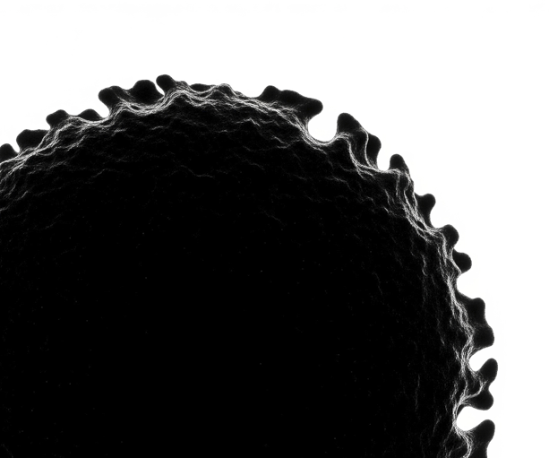
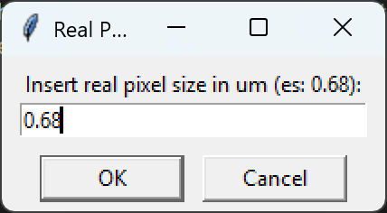
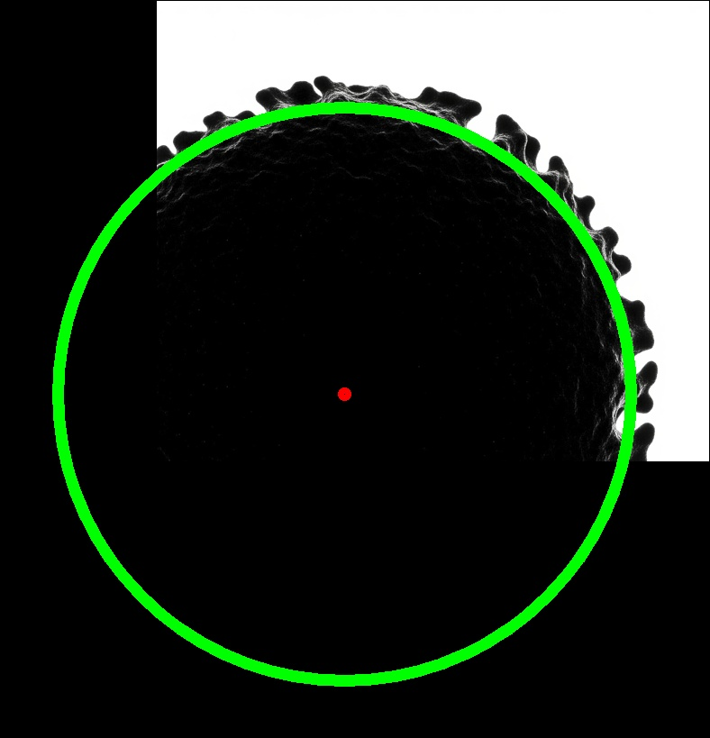
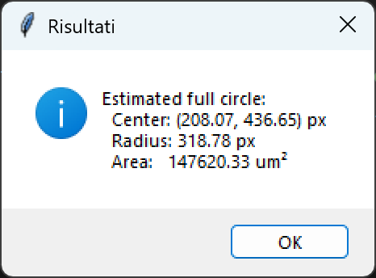

# OrganoidAreaEstimator

  

    The program allows you to estimate the area of an organoid even if only a part of it is visible in the image. By analyzing the visible section, the tool extrapolates the total area, providing a useful measurement for research and analysis.
  

  

## Usage

The executable is originally meant to run on a Windows pc but it can run also on Linux powered devices. 

Start the application by following intructions:
- Download the executable file from the repository.
- Locate the file on your PC.
- Right-click the file and select "Run as administrator" to start the program.

## Results

Below is an example of the application's input and output. The left side shows the input image with a partially visible organoid, while the right side displays the estimated full organoid area as computed by the program.

  

    <strong>Input</strong> 
    
    
  

  

    <strong>Output</strong> 
    
    
  

## Credits

This repository has been created and maintained by Federico Girlanda and it aims to be useful for research purposes. Please, cite the resource to make it available to others.